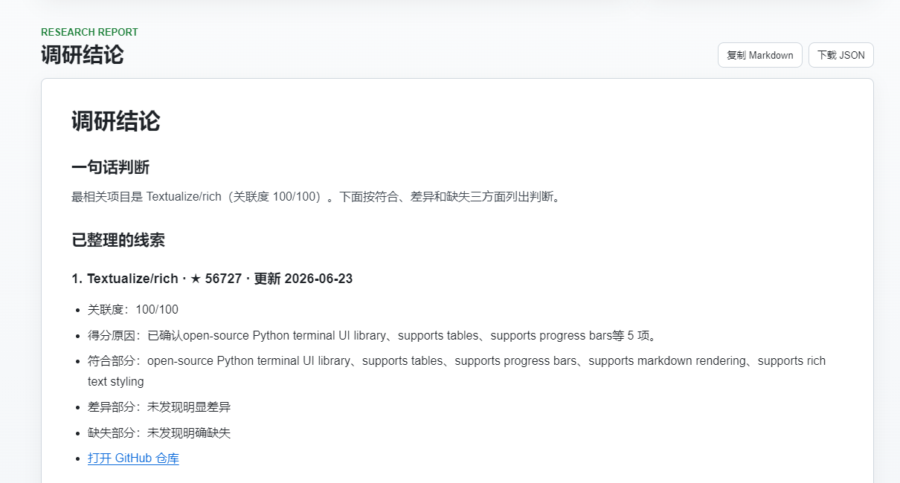
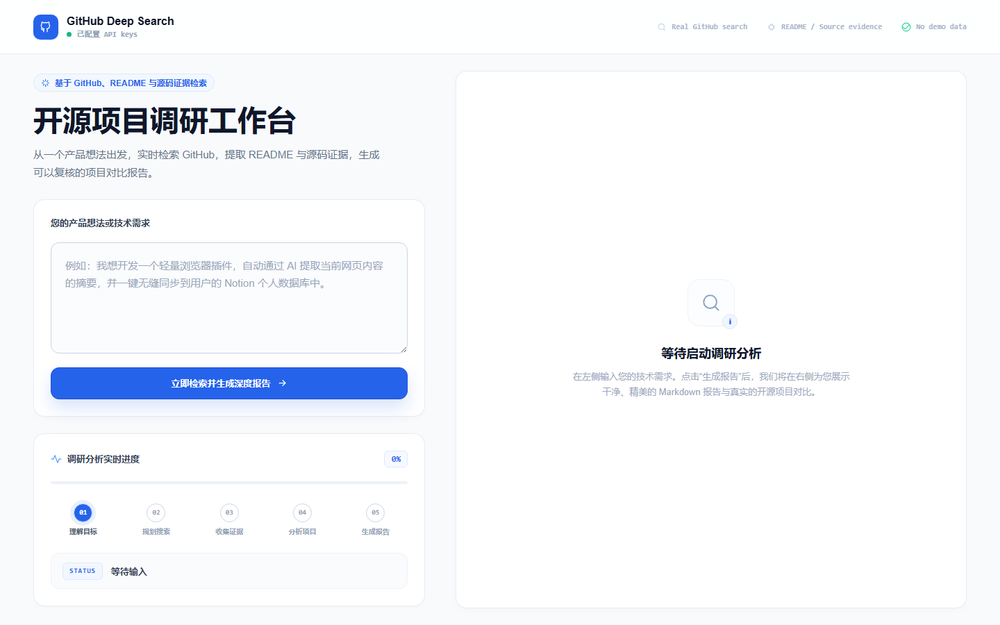
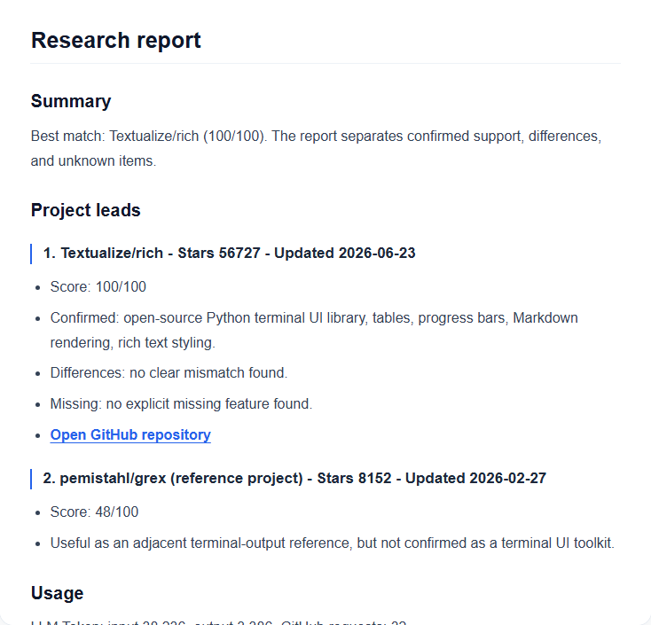

# GitHub Deep Search

> 输入一句产品想法，真实搜索 GitHub，快速判断有没有可复用、可借鉴、值得避开的开源项目。

**适合谁：** 正在做产品 idea 验证、技术选型、竞品调研、开源复用判断的人。

**它不是：** 内置 Demo、假排行榜、静态关键词匹配器。报告来自当前输入触发的 GitHub 搜索、README/源码证据和 LLM 分析。



上图来自一次真实本地运行，不是内置 Demo，也不是预置结果。

## 15 秒看懂

输入：

```text
我想做一个浏览器插件，可以总结网页内容，并把摘要同步到 Notion。
```

输出：

| 你关心的问题 | GitHub Deep Search 给出的结果 |
| --- | --- |
| GitHub 上有没有类似项目？ | Top 仓库、关联度、star、更新时间 |
| 能不能直接复用？ | 直接可用 / 参考项目 / 相邻参考 |
| 为什么这么判断？ | README、源码、路径等证据来源 |
| 还缺什么？ | 缺口、差异、风险、需要改造的地方 |
| 跑一次贵不贵？ | GitHub 请求数、LLM token、可选美元估算 |

## 真实运行结果

本次真实运行：

- 查询：`Find an open-source Python terminal UI library that supports tables, progress bars, markdown rendering, and rich text styling.`
- Top 结果：`Textualize/rich`
- 报告记录消耗：输入 `38,236` tokens，输出 `3,386` tokens
- 完整截图和记录：[docs/REAL_RUNS.md](docs/REAL_RUNS.md)

<details>
<summary>查看完整截图</summary>





</details>

## 一行启动

```bash
python scripts/start_web.py
```

打开终端输出的地址，通常是 http://127.0.0.1:8001。

启动器会自动创建 `.venv`、安装依赖、创建 `config/user_keys.env`，然后启动 Web 服务。

## 必须配置 API Key

没有 key 可以打开界面，但不会得到可信的真实调研报告。

```env
GITHUB_TOKEN=your_public_read_token
LLM_API_KEY=your_openai_compatible_key
LLM_BASE_URL=https://api.openai.com/v1
LLM_MODEL=your-model-name
TAVILY_API_KEY=
```

- `GITHUB_TOKEN`：真实使用基本必需。未认证 GitHub 请求额度太低。
- `LLM_API_KEY`：必需。用于需求解析、查询规划、项目比较和最终报告。
- `TAVILY_API_KEY`：可选。用于 Web 交叉验证和补充发现。

建议 GitHub token 只授予公开仓库只读权限，不要授予写权限。

## 预期消耗

Web 默认使用 `detailed + continue`，优先保证召回质量。

| 模式 | GitHub 请求上限 | 候选项目上限 | Tavily 上限 | 典型 LLM tokens |
| --- | ---: | ---: | ---: | ---: |
| `standard` | 40 | 30 | 最多 4 credits | 15k-45k |
| `high` | 72 | 54 | 最多 4 credits | 30k-80k |
| `continue` | 92 | 69 | 最多 4 credits | 40k-110k |

可选美元估算：

```env
LLM_INPUT_USD_PER_1M=0
LLM_OUTPUT_USD_PER_1M=0
TAVILY_USD_PER_CREDIT=0.008
```

成本公式：

```text
input_tokens / 1,000,000 * LLM_INPUT_USD_PER_1M
+ output_tokens / 1,000,000 * LLM_OUTPUT_USD_PER_1M
+ tavily_credits * TAVILY_USD_PER_CREDIT
```

价格和限额会变化，批量运行前请以自己的服务商控制台为准。

## 为什么不用普通 GitHub 搜索或直接问 LLM？

普通 GitHub 搜索容易漏掉 README、代码路径、Issue 和 Topic 里的线索。直接问 LLM 很快，但常见问题是结果过时、证据不足、把“看起来像”的项目说成可用。

GitHub Deep Search 做的是中间层：

```text
自然语言需求
=> 结构化 SearchSpec
=> GitHub repo / code / topic / issue 搜索
=> README、文件树、关键源码证据采集
=> 证据覆盖排序
=> 项目对比报告
```

## 信任边界

- 不内置 Demo 报告。
- 不内置假仓库、假排行或 seeded result data。
- 不使用静态产品领域同义词表、业务关键词包、仓库白名单或黑名单排序捷径。
- 测试夹具不会被 Web、CLI、MCP server 或搜索引擎运行时加载。
- 每份真实报告都来自当前用户输入、实时 provider 响应、仓库证据和配置的 LLM。

## CLI

```bash
python -m github_deep_search "找一个可自部署的 AI Agent 可视化工作流编排工具，最好有插件机制"
```

```bash
python -m github_deep_search "your requirement" --mode detailed --format markdown
python -m github_deep_search "your requirement" --budget high --format json
python -m github_deep_search "your requirement" --budget continue --format json
```

## Docker

```bash
docker compose up --build
```

然后打开 http://127.0.0.1:8001。

## Web 体验

- 一行命令启动。
- Header 显示 API key 配置状态。
- 展示解析、搜索、证据采集、分析、报告生成进度。
- 支持复制 Markdown 和下载 JSON。

## 项目状态

这是一个早期开源原型，目标是让产品想法和技术选型阶段的 GitHub 调研更快、更有证据感。后续会继续围绕召回质量、报告可读性和成本控制迭代。

Roadmap: [docs/ROADMAP.md](docs/ROADMAP.md)

## MCP

```bash
pip install -r requirements-mcp.txt
python -m github_deep_search.mcp_server
```

MCP tool 名称：`github_deep_search`。

## 测试

```bash
pip install -r requirements.txt
pytest -q
python -m compileall github_deep_search tests
```

Web 渲染回归：

```powershell
pip install -r requirements-e2e.txt
python -m playwright install chromium
pytest -q -m e2e
```

Live eval 默认跳过：

```powershell
$env:RUN_LIVE_EVAL = "1"
pytest -q -m live
```

## 贡献

欢迎提交真实搜索 miss、复现 query、UX 反馈、Provider 兼容性修复和聚焦的 PR。请先阅读 [CONTRIBUTING.md](CONTRIBUTING.md)。

如果这个项目帮你节省了调研时间，给一个 star 会让更多正在做产品想法验证的人看到它。
