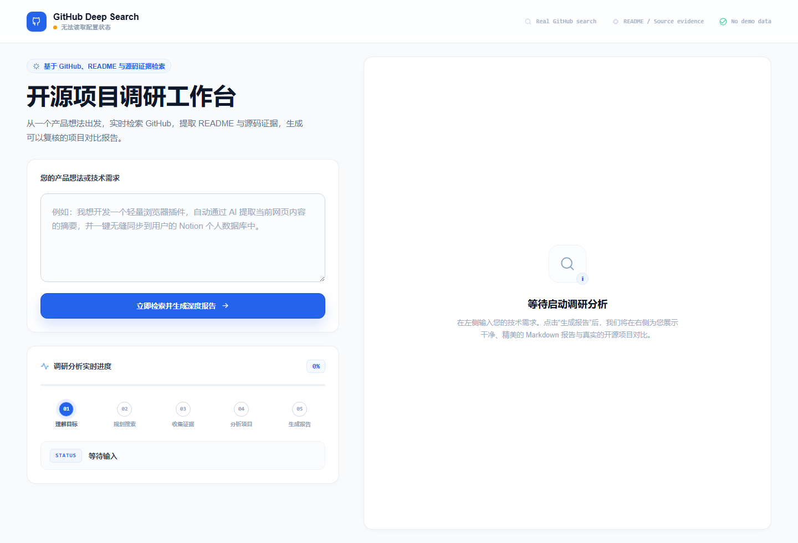
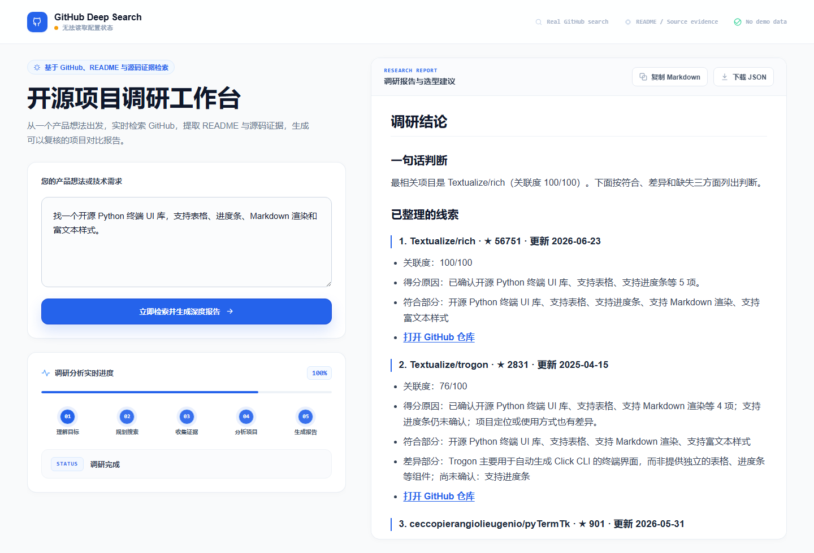

<h1 align="center">GitHub Deep Search</h1>

<p align="center">
  用一句产品想法，真实搜索 GitHub，判断哪些开源项目值得复用、借鉴或避开。
</p>

<p align="center">
  <a href="https://github.com/wp-i/github-deep-search/stargazers"></a>
  <a href="https://github.com/wp-i/github-deep-search/actions/workflows/ci.yml"></a>
  
  
  
  
</p>

<p align="center">
  <a href="#一分钟跑起来">一分钟跑起来</a>
  · <a href="#真实运行效果">真实运行效果</a>
  · <a href="#api-key-与消耗">API Key 与消耗</a>
  · <a href="#信任边界">信任边界</a>
</p>

<p align="center">
  <strong>默认打开页面</strong><br>
  
</p>

<p align="center">
  <strong>搜索后结果页</strong><br>
  
</p>

> 上图展示当前 Web 工作台的默认状态和搜索完成后的报告状态；报告仍来自真实搜索，不是内置 Demo、预置报告或假仓库排行。

## 它解决什么

| 你原本要手动做的事 | GitHub Deep Search 做的事 |
| --- | --- |
| 在 GitHub 反复换关键词 | 把自然语言需求拆成结构化搜索角度 |
| 点开仓库看 README 和源码 | 采集 README、文件树、关键源码路径证据 |
| 判断项目能不能复用 | 输出匹配理由、差异、缺口和风险 |
| 估算一次调研花了多少成本 | 展示 GitHub 请求数、LLM tokens 和可选美元估算 |

## 15 秒看懂

```text
我想做一个浏览器插件，可以总结网页内容，并把摘要同步到 Notion。
```

| 输出块 | 你会看到什么 |
| --- | --- |
| Top 项目 | 最相关仓库、star、更新时间、关联度 |
| 复用判断 | 直接可用 / 参考项目 / 相邻参考 |
| 证据来源 | README、源码、路径、Topic、Issue 线索 |
| 差异缺口 | 缺什么、哪里不匹配、需要改造什么 |
| 消耗记录 | 本次 GitHub 请求数、LLM 输入/输出 tokens |

## 一分钟跑起来

Clone 后进入项目目录，只需要这一行启动 Web：

```bash
python scripts/start_web.py
```

启动器会自动创建 `.venv`、安装依赖、创建 `config/user_keys.env`，然后启动 Web 服务。打开终端输出的地址，通常是 http://127.0.0.1:8001。

当前 Web 入口由 FastAPI 直接服务静态文件：

- `github_deep_search/static/index.html`
- `github_deep_search/static/styles.css`
- `github_deep_search/static/app.js`

仓库运行时不需要单独的 React/Tailwind 构建步骤，也不提交设计稿工程或 `node_modules` 产物。

## 真实运行效果

| 项目 | 本次真实记录 |
| --- | --- |
| 查询 | `找一个开源 Python 终端 UI 库，支持表格、进度条、Markdown 渲染和富文本样式。` |
| Top 3 结果 | `Textualize/rich`、`Textualize/trogon`、`ceccopierangiolieugenio/pyTermTk` |
| 报告消耗 | 每次导出的 JSON 会记录 GitHub 请求数与 LLM tokens，具体数值随 provider、模型和搜索预算变化 |
| 结果来源 | 真实 GitHub 检索与证据分析，截图不是内置 demo 数据 |
| 完整记录 | [docs/REAL_RUNS.md](docs/REAL_RUNS.md) |

## API Key 与消耗

没有 key 可以打开界面，但不会得到可信的真实调研报告。

```env
GITHUB_TOKEN=your_public_read_token
LLM_API_KEY=your_openai_compatible_key
LLM_BASE_URL=https://api.openai.com/v1
LLM_MODEL=your-model-name
TAVILY_API_KEY=
```

| Key | 是否必需 | 用途 |
| --- | --- | --- |
| `GITHUB_TOKEN` | 基本必需 | 提高真实 GitHub 搜索额度，建议只授予公开仓库只读权限 |
| `LLM_API_KEY` | 必需 | 需求解析、查询规划、项目比较、最终报告 |
| `TAVILY_API_KEY` | 可选 | Web 交叉验证和补充发现 |

Web 默认使用 `detailed + continue`，优先保证召回质量。

| 模式 | GitHub 请求上限 | 候选项目上限 | Tavily 上限 | 典型 LLM tokens |
| --- | ---: | ---: | ---: | ---: |
| `standard` | 40 | 30 | 最多 4 credits | 15k-45k |
| `high` | 72 | 54 | 最多 4 credits | 30k-80k |
| `continue` | 92 | 69 | 最多 4 credits | 40k-110k |

<details>
<summary>查看美元估算配置</summary>

```env
LLM_INPUT_USD_PER_1M=0
LLM_OUTPUT_USD_PER_1M=0
TAVILY_USD_PER_CREDIT=0.008
```

```text
input_tokens / 1,000,000 * LLM_INPUT_USD_PER_1M
+ output_tokens / 1,000,000 * LLM_OUTPUT_USD_PER_1M
+ tavily_credits * TAVILY_USD_PER_CREDIT
```

价格和限额会变化，批量运行前请以自己的服务商控制台为准。

</details>

## 为什么不是普通搜索

```text
自然语言需求
=> 结构化 SearchSpec
=> GitHub repo / code / topic / issue 搜索
=> README、文件树、关键源码证据采集
=> 证据覆盖排序
=> 项目对比报告
```

普通 GitHub 搜索容易漏掉 README、代码路径、Issue 和 Topic 里的线索。直接问 LLM 很快，但常见问题是结果过时、证据不足、把“看起来像”的项目说成可用。

## 信任边界

| 不做什么 | 为什么重要 |
| --- | --- |
| 不内置 Demo 报告 | 首次体验不会被预置结果误导 |
| 不内置假仓库、假排行或 seeded result data | 排名来自当前输入和实时 provider 响应 |
| 不使用静态产品同义词表、业务关键词包、仓库白名单或黑名单排序捷径 | 搜索语义必须来自当前需求和真实仓库证据 |
| 测试夹具不会被 Web、CLI、MCP server 或搜索引擎运行时加载 | 测试数据不会混入真实运行 |
| 不把弱证据包装成高置信结果 | 未确认核心能力时只保留低置信参考或相邻线索 |

每份真实报告都来自当前用户输入、实时 provider 响应、仓库证据和配置的 LLM。

## CLI

```bash
python -m github_deep_search "找一个可自部署的 AI Agent 可视化工作流编排工具，最好有插件机制"
python -m github_deep_search "your requirement" --mode detailed --format markdown
python -m github_deep_search "your requirement" --budget high --format json
python -m github_deep_search "your requirement" --budget continue --format json
```

## Docker

```bash
docker compose up --build
```

然后打开 http://127.0.0.1:8001。

## Web 体验

| 能力 | 状态 |
| --- | --- |
| 一行命令启动 | 已支持 |
| API key 配置状态提示 | 已支持 |
| 解析、搜索、证据采集、分析、报告生成进度 | 已支持 |
| 可靠匹配、参考项目、相邻线索分层 | 已支持 |
| 复制 Markdown、下载 JSON | 已支持 |
| LLM token、GitHub 请求数、可选美元估算 | 已支持 |
| MCP tool | 已支持 |

## 项目状态

这是一个早期开源原型，目标是让产品想法和技术选型阶段的 GitHub 调研更快、更有证据感。后续会继续围绕召回质量、报告可读性和成本控制迭代。

Roadmap: [docs/ROADMAP.md](docs/ROADMAP.md)

## MCP

```bash
pip install -r requirements-mcp.txt
python -m github_deep_search.mcp_server
```

MCP tool 名称：`github_deep_search`。

## 测试

```bash
pip install -r requirements.txt
pytest -q
python -m compileall github_deep_search tests
```

Web 渲染回归：

```powershell
pip install -r requirements-e2e.txt
python -m playwright install chromium
pytest -q -m e2e
```

Live eval 默认跳过：

```powershell
$env:RUN_LIVE_EVAL = "1"
pytest -q -m live
```

## 贡献

欢迎提交真实搜索 miss、复现 query、UX 反馈、Provider 兼容性修复和聚焦的 PR。请先阅读 [CONTRIBUTING.md](CONTRIBUTING.md)。

如果这个项目帮你节省了调研时间，给一个 star 会让更多正在做产品想法验证的人看到它。
